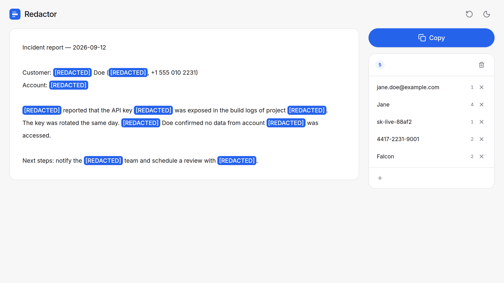
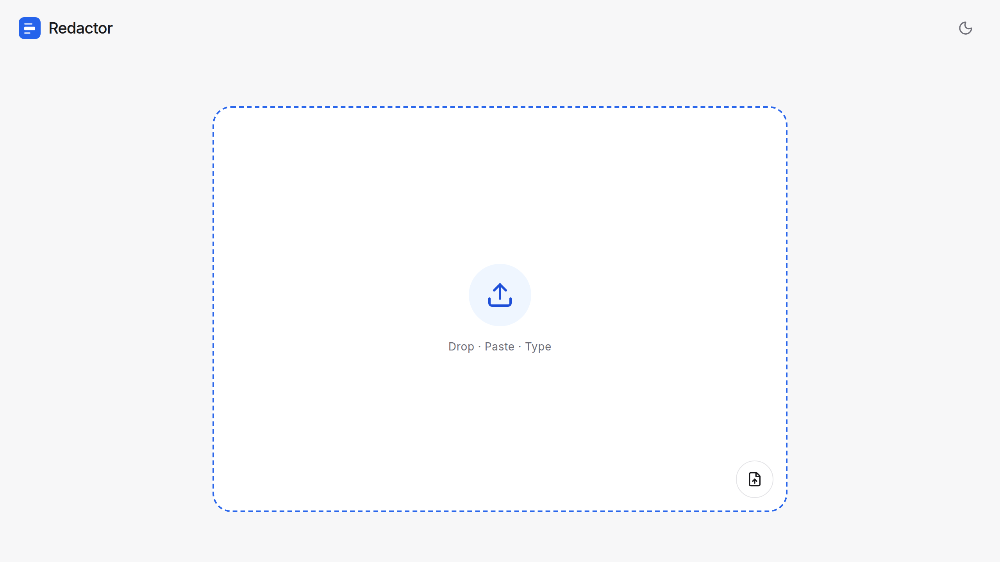
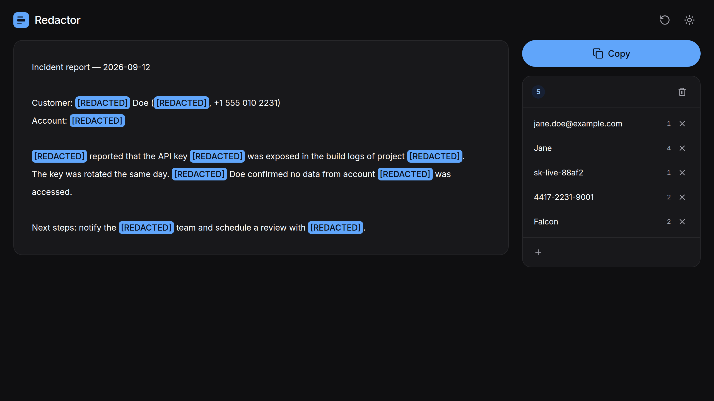
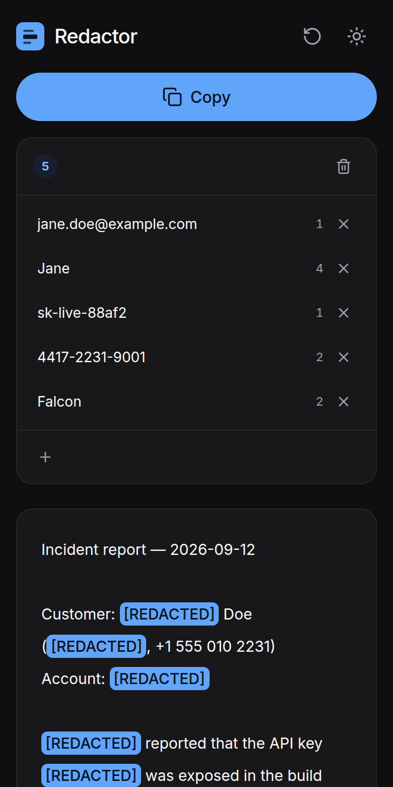

# Text Redactor

A Next.js app for redacting sensitive text by clicking on it. Everything runs in the browser, so
the text never leaves your machine.



| Start | Dark mode | Phone |
| :---: | :---: | :---: |
|  |  |  |

## Use it

1. **Drop** a file anywhere on the page, **paste** text, or pick a file with the file button.
   See [Supported files](#supported-files).
2. **Click a word** to redact it everywhere it appears. **Select a phrase** to redact the whole
   phrase. **Click a `[REDACTED]`** to restore it.
3. Redacted terms are listed in the side panel. Remove one with `×`, clear all of them with the
   bin icon, or type a term into the `+` field.
4. **Copy** puts the redacted text on your clipboard.

The icon in the top-right switches between light and dark mode. The first visit follows the
system setting; after that your choice is remembered.

## Supported files

| Format | Files | What you get |
| --- | --- | --- |
| Plain text | `.txt`, `.md`, `.csv`, `.json`, `.log`, `.xml`, `.html`, source code, anything UTF-8 | The file as is |
| PDF | `.pdf` | Text of every page, pages separated by a blank line |
| Word | `.docx` | Body paragraphs (headers, footers and comments aren't included) |
| PowerPoint | `.pptx` | Slide text in slide order |
| Excel | `.xlsx` | Each sheet as tab-separated rows |
| OpenDocument | `.odt`, `.odp`, `.ods` | Paragraphs, with tables as tab-separated rows |
| Rich text | `.rtf` | Text without formatting |

The format is detected from the file's content, not its name. Formatting isn't kept: you get the
text, redact it, and copy plain text. Scanned PDFs with no text layer show "No text found", and
old binary Office files (`.doc`, `.xls`, `.ppt`), images and other binaries show "Can't read this
file". Save those as `.docx`/`.xlsx`/`.pptx` or PDF first.

## How matching works

- Case-insensitive, and special characters are matched literally.
- A term that starts or ends with a letter or digit only matches at a word boundary on that side,
  so `an` never redacts part of `and`.
- Longer terms win, so `jane@corp.io` stays one redaction even when `Jane` is also a term.
  With only `Jane` as a term, `jane@corp.io` becomes `[REDACTED]@corp.io`.

## Develop

Requires Node.js 22.

```bash
npm install
npm run dev          # http://localhost:3000
```

| Script              | What it does                                           |
| ------------------- | ------------------------------------------------------ |
| `npm test`          | Unit and component tests (Vitest + Testing Library)    |
| `npm run test:e2e`  | Builds the production app and runs Playwright on it    |
| `npm run lint`      | ESLint                                                 |
| `npm run typecheck` | TypeScript                                             |
| `npm run build`     | Production build                                       |
| `npm run check`     | Lint, typecheck, unit tests and build in one go        |

Run `npx playwright install chromium` once before the first e2e run. To use a Chromium that is
already installed instead, set `CHROMIUM_PATH` to its executable.

## Layout

```
src/
  app/            layout (theme bootstrap script, fonts) and the single page
  components/     Redactor (state), Intake (start screen), Viewer, TermsPanel, ThemeToggle, Logo
  lib/redact.ts   matching, redaction and word tokenizing
  lib/file.ts     detecting the file format, reading it, copying to the clipboard
  lib/extract/    PDF (pdf.js, loaded on demand), Office/OpenDocument (unzip + XML) and RTF
test/fixtures.ts  builds sample PDF, Word, PowerPoint, Excel, OpenDocument and RTF files for tests
e2e/              Playwright tests
docs/screenshots/ images used in this README
.claude/          Claude Code project settings (lints when a session stops)
```

## Stack

| Layer | Technology |
| --- | --- |
| Framework | [Next.js](https://nextjs.org/docs/app) 16 (App Router), React 19 |
| Language | TypeScript |
| Styling | [Tailwind CSS](https://tailwindcss.com/) 4, [Lucide](https://lucide.dev/) icons, [Inter](https://rsms.me/inter/) font |
| Documents | [pdf.js](https://mozilla.github.io/pdf.js/) for PDF, [fflate](https://github.com/101arrowz/fflate) for Office/OpenDocument |
| Tests | [Vitest](https://vitest.dev/) + Testing Library, [Playwright](https://playwright.dev/) |

Colours are CSS variables in `src/app/globals.css`: a neutral zinc foundation with a single blue
accent, redefined for dark mode. The font is bundled through `@fontsource-variable/inter`, so the
build needs no network access.

## Contributing

Issues and pull requests are welcome. Before opening a pull request, run `npm run check` and
`npm run test:e2e`.

## License

Copyright (C) 2026 the text-redact contributors.

This program is free software: you can redistribute it and/or modify it under the terms of the
GNU General Public License, version 3, as published by the Free Software Foundation. It is
distributed in the hope that it will be useful, but WITHOUT ANY WARRANTY; without even the
implied warranty of MERCHANTABILITY or FITNESS FOR A PARTICULAR PURPOSE. See [LICENSE](LICENSE)
for the full text.
